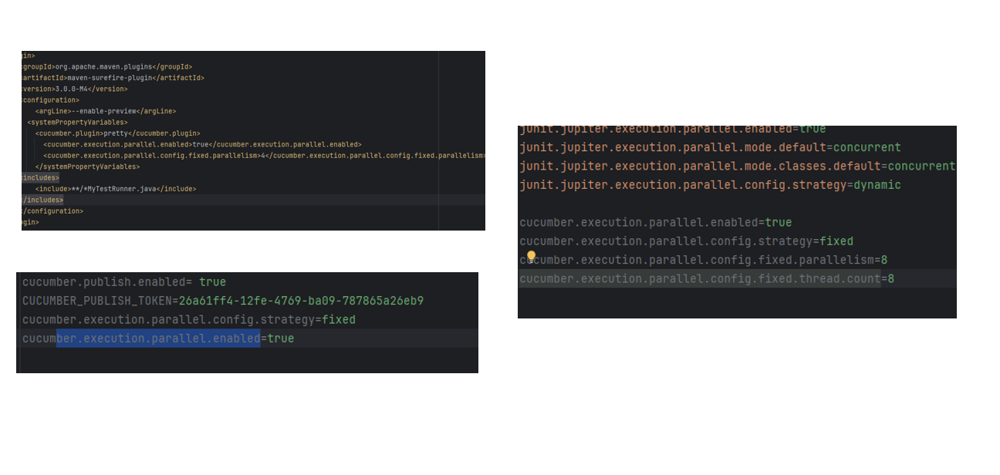

# Playwright-Cucumber Test Framework

This is a **Test Automation Framework** built with **Playwright** and **Cucumber**, designed to facilitate reliable UI testing. The framework leverages the power of Playwright for browser automation and Cucumber for behavior-driven development (BDD), making it easy to write readable and maintainable test scenarios.

---

## 📋 Tech Stack

- **Programming Language:** Java (JDK 21)
- **Test Framework:** Cucumber (Behavior-Driven Development)
- **Browser Automation Tool:** Playwright
- **Build Tool:** Maven
- **Reporting Tool:** Cucumber Reports
- **Dependency Management:** Maven Dependency Management
- **Other Tools:**
    - Log4j for Logging
    - JUnit for Test Execution

---

## 📂 Project Structure

Here is an overview of the project structure:


---

## ✅ Test Scenarios Covered

Below are some of the test scenarios automated in this project:

### 1. **Login Scenarios**
- Verify successful login with valid credentials.
- Verify error messages for invalid credentials.
- Verify user is returned to the login page after logout.


### 2. **Add Book Scenarios**
- Verify successful addition of a new book.
- Verify error messages for invalid book details.
- Verify that the added book is displayed in the book list.
- Verify that the added book is displayed in the book details page.
- Verify only authorized users can add a book.


## ❌ Failed Scenarios Identified by Automation

The following failed scenarios were identified while running the automated tests. These failures may indicate bugs in the application or areas requiring further investigation:

### **Login Scenarios**

1. **Scenario:** `Verify user is returned to the login page after logout'
    - **Failure Reason:** Logged users are still able to access the application.
    - **Suggestion:** Fix authentication logic on the backend to reject logged out users.
2. **Scenario:** 'Unauthenticated users cannot add a book'
    - **Failure Reason:** Unauthenticated users can add a book.
    - **Suggestion:** Implement authentication logic to restrict unauthorized users from adding books.

##  📊 Test Execution Report

The test execution report provides detailed information about the test scenarios, including the number of scenarios passed, failed, and skipped. The report also includes the duration of the test run and the steps executed in each scenario.


## 🚀 Getting Started

### Prerequisites
1. Install [Java JDK 21](https://www.oracle.com/java/technologies/javase-jdk21-downloads.html).
2. Install [Maven](https://maven.apache.org/install.html).
3. Configure your desired browser (Playwright supports Chromium, Firefox, and Webkit).

### Steps to Run the Tests

1. Clone this repository:
   ```bash
   git clone <REPOSITORY_URL>
2. Navigate to theproject directory:
    ```bash
   cd playwrightjava
3. Run the tests using Maven:
   ```bash
    mvn test
4. View the test reports:
5. Open the `target/cucumber-reports/index.html` file in a browser to view the test reports.

## 🛠️ Configuration

All configurations are maintained in the `application.properties` file. Below are some key properties:

- **Browser Configuration**:
  Configure the browser type and behavior (headless/headed).
- **Base URL**:
  Set the base URL for the application under test.

```properties
browser=chrome
headless=true
baseUrl=https://example.com
```

---

## 🌟 Features of This Framework

1. **Behavior-Driven Approach**:
    - Uses Gherkin syntax to write readable test scenarios (`Given`, `When`, `Then` statements).

2. **Page Object Model**:
    - Follows the POM design pattern for maintaining reusable and modular page classes.

3. **Cross-Browser Testing**:
    - Supports multi-browser testing (Chromium, Firefox, Webkit).

4. **Parallel Execution**:
    - Enables faster test execution by running scenarios or feature files simultaneously.

5. **Reporting**:
    - Generates detailed cucumber reports with  test execution details.

## 🔄 Parallel Execution with Cucumber

This framework implements **parallel execution** for Cucumber test scenarios to improve test execution efficiency. The parallel execution enables multiple feature files or scenarios to run simultaneously, distributing workloads across available resources and significantly reducing overall test execution time.

The **Cucumber JVM Parallel Plugin** is used to generate separate runners for each feature file, allowing scenarios to execute concurrently.

### Configuration for Parallel Execution
- **Maven Surefire Plugin** is configured to enable parallel test execution.
- The framework uses the `cucumber-jvm-parallel-plugin` to split and execute feature files in parallel.




### Running Tests in Parallel
To run tests in parallel, use the following Maven command:
```bash
mvn test -Dcucumber.options="--threads 3"
```
    


## 🧩 Future Enhancements

- Integrate with CI/CD tools like Jenkins or GitHub Actions.
- Implement a Docker container for running tests.
- Extend the reporting capabilities with allure reports.
- Add API Testing support.
- Improve test coverage with additional test scenarios.
- Implement data-driven testing using external sources (e.g., Excel, JSON).
   
    